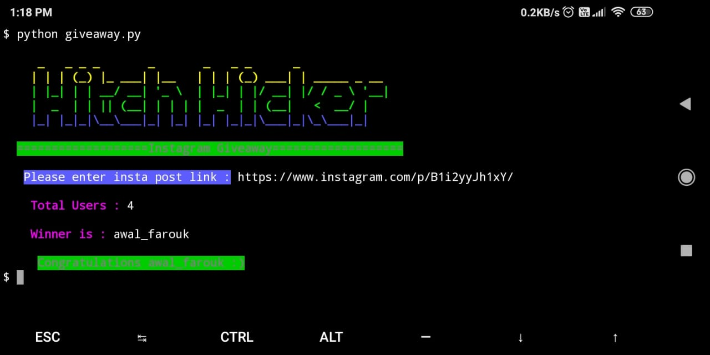

# insta_giveaway
python based tool for instagram giveaway. This script will select randomly one user from all users who commented on your insta post.

This script is use [instaloader](https://github.com/instaloader/instaloader) library.

### REQUIREMENTS:
- python3
- instaloader library

### USAGE:
```
git clone https://github.com/hitchhicker007/insta_giveaway.git
cd insta_giveaway
pip install instaloader
python giveaway.py
```

### SCREENSHOT:

